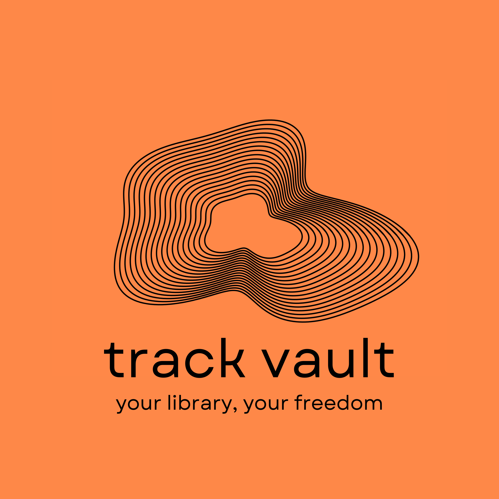

# TrackVault



## TrackVault

TrackVault is a self-hosted music server, meaning no ads and you control your music.  Download this on your host computer and create a tunnel / port forward to access it from outside your network.

- `http://localhost:8096/admin` for server settings, scans, and library health
- `http://localhost:8096/app` for browsing and playing the music library

It runs on built-in Node.js APIs and stores local state in `.trackvault/`.

## Help keep TrackVault free

I want to keep TrackVault always free and open source.  Feel free to support my work, anything helps!  Of course it is not required so do not feel like you have to.

[](https://ko-fi.com/dcchill)

## Run

On Windows, double-click `Start TrackVault.bat`. It starts the server and opens the player UI.

Or run it from PowerShell:

```powershell
npm start
```

By default TrackVault scans `./library`. You can change the library path in the admin UI or set it before launch:

```powershell
$env:TRACKVAULT_LIBRARY="D:\Music"
npm start
```

Optional environment variables:

- `PORT`: server port, defaults to `8096`
- `TRACKVAULT_LIBRARY`: initial music library path
- `TRACKVAULT_DATA`: state directory, defaults to `.trackvault`

Supported scan extensions include `.mp3`, `.flac`, `.m4a`, `.aac`, `.wav`, `.ogg`, `.opus`, and `.webm`.

## TrueNAS SCALE

TrackVault includes a TrueNAS SCALE custom app package in `deploy/truenas/`.

The easiest path is to publish the Docker image with the included GitHub Actions workflow, then paste `deploy/truenas/trackvault.yaml` into TrueNAS **Install via YAML**.

See `deploy/truenas/README.md` for the full setup.

## Disclaimer : Support your artists

TrackVault does not support pirating music, acquire your music legally and support artists.

To acquire music files check out

- https://bandcamp.com/
- https://www.qobuz.com/us-en/discover

If you are going to pirate music, at least support the artist and buy their albums first.
